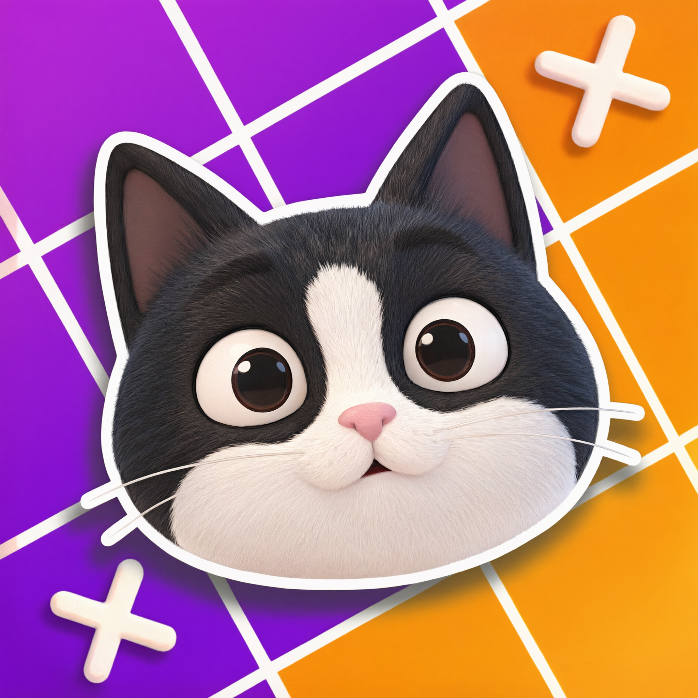

  

<h1 align="center">MeowDoku Auto Solver</h1>

  <a href="README_ru.md">Русский</a> | English

  Automated solver for <a href="https://play.google.com/store/apps/details?id=com.oakever.meowdoku">MeowDoku</a> built on top of <a href="https://play.google.com/store/apps/details?id=com.kok_emm.mobile">Macrorify</a> automation engine.

## Overview

This repository contains an EMScript macro that fully automates level progression in MeowDoku. The macro reads the board by color sampling, solves the puzzle with a backtracking algorithm that enforces all game rules, places the cats with the correct two tap sequence, and handles victory and defeat screens. It can be launched either from the main menu or directly inside an active level.

## Requirements

* Android device or emulator (Android 7+)
* [Macrorify](https://play.google.com/store/apps/details?id=com.kok_emm.mobile) installed and configured
* [MeowDoku](https://play.google.com/store/apps/details?id=com.oakever.meowdoku) installed
* Accessibility Service or Native Service enabled in Macrorify
* Screen capture permission granted

## Installation

1. Go to the [Releases](../../releases) section and download the latest `.mrscript` macro file.
2. Open Macrorify and import the macro via the macro import menu.
3. Launch MeowDoku and leave it on the main menu or inside any level.
4. Start the macro from Macrorify overlay.

## How It Works

The macro operates in a continuous loop with the following stages:

* **Start detection.** The macro probes the screen for an active board. If none is found, it looks for the main menu button and enters the first level automatically.
* **Board reading.** Rows and columns are located by scanning horizontal and vertical lines and detecting colored cell runs by saturation. Cell centers are computed from the runs, so the macro adapts to any board size from 4x4 to 12x12.
* **Region grouping.** All cell colors are sampled in one batch and clustered into color regions using CIE76 delta E.
* **Solving.** A backtracking solver places one cat per row, respecting column uniqueness, region uniqueness, and the non adjacency rule (no cats touching horizontally, vertically or diagonally).
* **Placing.** Each target cell receives two taps: the first draws a cross, the second turns it into a cat.
* **Post level Handling.** If the board is lost, the retry button is pressed. On victory, the macro waits exactly 8 seconds after the last cat tap and closes the leaderboard, then waits for the next level button and proceeds.

## Configuration

All tunable constants are at the top of the macro:

| Parameter | Default | Description |
| --- | --- | --- |
| `PLACE_TAPS` | 2 | Taps per cell. Keep 2 for the current tap cycle. |
| `TAP_HOLD` | 50 | Hold duration per tap in ms. |
| `TAP_GAP_INNER` | 150 | Pause between two taps on the same cell. |
| `TAP_GAP` | 300 | Pause between cells. |
| `CLOSE_DELAY` | 8000 | Delay in ms after the last cat before closing the leaderboard. |
| `DEBUG` | true | Enable debug toasts showing detected board size. |

## Device Compatibility

All coordinates are scaled from a 1080x2340 reference resolution. The macro works on any Android device or emulator without manual coordinate adjustments. On devices with unusual aspect ratios or system cutouts, minor tuning of scan region percentages may be needed.

## Troubleshooting

* **Macro hangs on start.** Make sure you are either on the main menu with the orange level button visible or inside a level with the board fully rendered.
* **"Regions X of Y" toast.** The color clustering picked up extra regions, usually because the board is still animating. The macro retries automatically.
* **Leaderboard does not close.** Increase `CLOSE_DELAY` by 1000 to 2000 ms and try again.
* **Cats not placed.** Verify that Macrorify has the correct touch capability enabled. Native Service is recommended on emulators.

## Files

* `MeowDoku.mrscript` (in Releases): the compiled macro
* `MeowLogo.png`: repository logo
* `README.md`: English documentation
* `README_ru.md`: Russian documentation

## Legal

This project is not affiliated with, endorsed by, or connected to OakEver or the Macrorify development team. The macro is provided for educational and personal use. Respect the game's terms of service when using automation tools.
